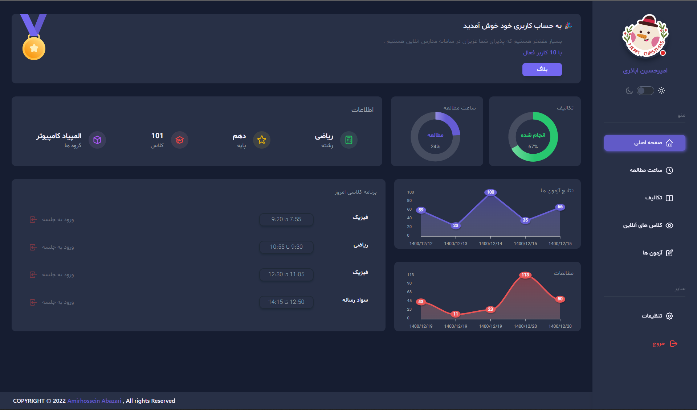

# School CMS / Reactjs - PHP - Tailwind

A Full-Stack SPA School CMS Build With Reactjs - PHP - Tailwind  / Dark Theme - Light Theme

 
 

https://user-images.githubusercontent.com/92695669/158592972-de8e82a6-ba3f-4c7e-95f8-4da452b5e144.mp4

- [x] React 17.0.2
- [x] PHP 8.1
- [x] Tailwindcss v3.0.23
- [x] daisyUI
- [x] Restful API
- [x] MySQL
- [x] Dark/Light Theme Support
- [x] Latest Webpack , Babel 7 and Webpack Dev Server ,with Scope Hoisting enabled
- [x] ES6 linting with continuous linting on file change
- [x] Separate CSS stylesheets generation
- [x] Automatic HTML generation

## Starting the dev server

Make sure you have the latest Stable or LTS version of Node.js installed.

1. `git clone https://github.com/am-abazari/school-cms.git`
2. Run `npm install` or `yarn install`
3. Start the dev server using `npm start`
4. Put `Backend` Directory in Xampp/Wampp or ...
5. Create `my-app` Database
6. Import `sql.sql` file in `my-app` Database 
7. Change `BaseURL` to Where Directory/URL Backend Placed
8. Customize `Connection.php` to Your Own 
9. Open [http://localhost:3000/](http://localhost:3000/)

## Available Commands

- `npm start` - start the dev server
- `npm clean` - delete the dist folder
- `npm run build` - create a optimized build in `build` folder

## Code Coverage

The project is using the <strong>Ractjs - PHP - Tailwind</strong>. All configurations are located in `package.json - Connection.php`

The coverage report consists of an HTML reporter, which can be viewed in the browser and some helper coverage files like the coverage json file.

## About Author

<strong>Amirhossein Abazari</strong> Full-Stack Web Developer
